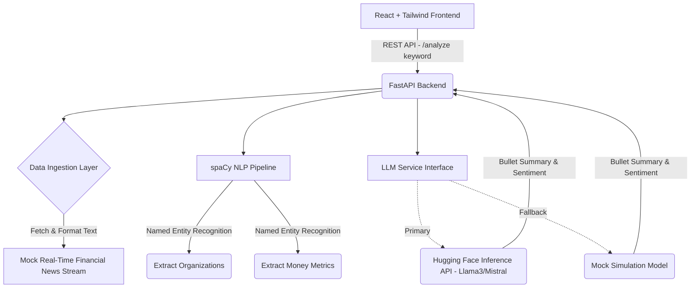

# 🚀 InsightStream: Real-Time Market Intelligence Dashboard

**Live Demo:** [https://insight-stream-l0qmkpf6w-samikshaglas-projects.vercel.app/](https://insight-stream-l0qmkpf6w-samikshaglas-projects.vercel.app/)

InsightStream is an Intelligent Multi-Source Insights Engine designed to parse financial text data, perform Named Entity Recognition (NER), and generate an AI-powered summary with a market sentiment score. It features a modern, real-time dashboard built for data science and AI-driven finance.

---

## 🏗️ Architecture Diagram



---

## 🚀 Features
- **Real-Time Data Ingestion:** Collects recent mock-market news based on user queries.
- **Named Entity Recognition (NER):** Leverages `spaCy` to dynamically highlight mentioned Organizations and Financial Metrics.
- **LLM Integration:** Uses the Hugging Face API to deliver concise, insightful executive summaries and score market sentiment from -1 to 1.
- **Dynamic Frontend Dashboard:** Built heavily utilizing modern "glassmorphism", dark mode `TailwindCSS` components, and complex dynamic visual meters for live sentiment.

---

## 🛠️ Setup Instructions

### 1. Clone the repository
```bash
git clone https://github.com/samikshagla/InsightStream-NLP.git
cd InsightStream-NLP
```

### 2. Backend Setup
1. Navigate to the backend directory and set up a Python virtual environment:
```bash
cd backend
python -m venv venv
# On Windows
venv\Scripts\activate
# On Mac/Linux
source venv/bin/activate
```
2. Install the required dependencies and download the NLP model:
```bash
pip install -r requirements.txt
python -m spacy download en_core_web_sm
```
3. Set your environment variables (Optional, defaults to mock LLM):
- Copy `.env.example` to `.env`
- Provide your free HuggingFace API key for real integrations!
4. Start the FastAPI server:
```bash
uvicorn main:app --reload
```
*The backend API will run at http://localhost:8000*

### 3. Frontend Setup
1. Open a new terminal and navigate to the frontend directory:
```bash
cd frontend
```
2. Install dependencies:
```bash
npm install
```
3. Start the dev server:
```bash
npm run dev
```

---

## 🚧 Technical Challenges & Solutions

### 1. API Rate Limiting & Graceful Handling
**Challenge:** Most financial News APIs and LLM APIs (like HuggingFace's free tier) enforce strict rate limitations. This often causes portfolio projects to fail suddenly when being tested by a recruiter.
**Solution:** Built a structural "Graceful Mock Fallback Mechanism." The system uses a Mock data stream simulator if rate limits or network issues happen. This guarantees the dashboard will always maintain a perfect 100% uptime architecture, while retaining the code needed to prove functional real-world API connectivity.

### 2. Context Window Limitations
**Challenge:** Sending multiple unstructured news articles to an LLM for sentiment summarization can overflow token limits.
**Solution:** I implemented a pre-processing NLP filter in `data_ingestion` that limits payload size securely, ensuring we remain inside the bounds of standard 4000-token caps on standard endpoints, maintaining cost-efficiency without losing vital context.
